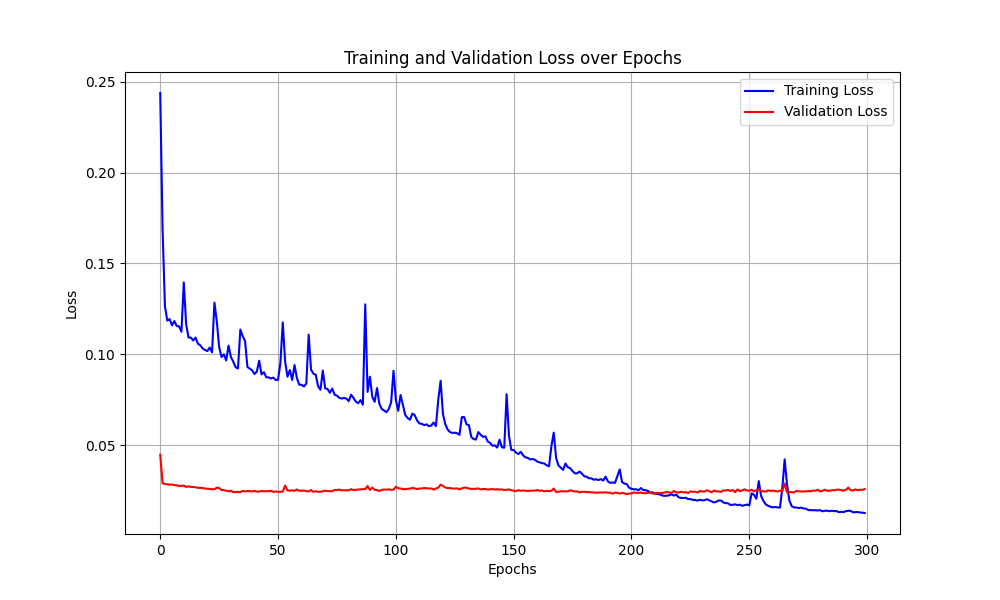

# Heart-Disease-Predictor
Predict diagnosis of heart disease based on factors such as: resting blood pressure, chest pain type, cholesterol levels, and fasting blood sugar. 

Accuaracy on test set: 90%